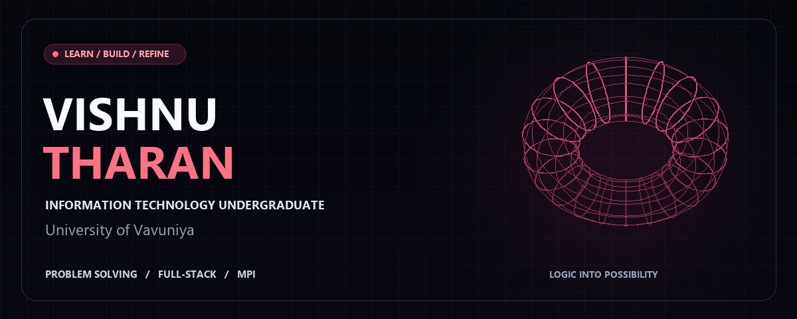
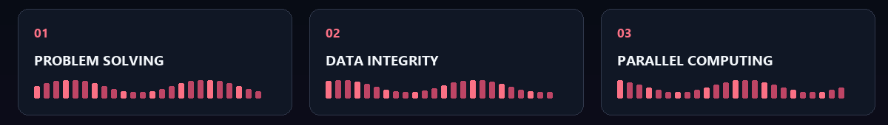

**Clean logic. Reliable data. Thoughtful performance.**

[About](#about-me) · [Toolkit](#technical-toolkit) · [Interests](#where-my-interests-connect) · [My Work](https://github.com/vishnu-tharan?tab=repositories) · [Connect](#lets-connect)

## About Me

I’m **Vishnu Tharan**, an **Information Technology undergraduate at the University of Vavuniya**, Faculty of Applied Science.

I enjoy the reasoning behind software: how an algorithm solves a problem, how a database keeps information consistent, and how multiple processes work together. My interests span **full-stack development**, **data-driven applications**, and **high-performance computing**.

**Problem solving is my primary focus.** I’m drawn to challenges that require breaking down complex logic, considering different approaches, and finding opportunities to improve efficiency. My guiding principle is to write **clean, scalable, and efficient code**.

> I want to understand both how a solution works and why it is a good fit for the problem.

| Academic foundation | Engineering interests |
| :--- | :--- |
| **Information Technology** undergraduate | Algorithmic reasoning and problem solving |
| **University of Vavuniya** | Full-stack application development |
| **Faculty of Applied Science** | Database integrity and parallel computing |

## Technical Toolkit

| Domain | Technologies | What draws my attention |
| :--- | :--- | :--- |
| **Programming** | `JavaScript` `C` `C++` | Clear logic, efficient algorithms, and reusable solutions |
| **Databases** | `SQL` `MongoDB` | Data modeling, consistency, and dependable application storage |
| **Parallel computing** | `MPI` | Collective communication, coordination, and performance |
| **Version control** | `Git` | Organized changes and a clear development history |
| **Development interests** | `Full-stack development` | Connecting interfaces, backend logic, and data |

<strong>Explore the technical topics I enjoy discussing</strong>

### JavaScript Essentials

I enjoy discussing the fundamentals that support application logic: control flow, functions, arrays, objects, and the organization of readable code.

### SQL Triggers & Database Integrity

I’m interested in how triggers respond to data changes, how validation supports consistency, and how database logic can contribute to auditing. I also enjoy thinking about where responsibilities belong between an application and its database.

### Collective Communication in MPI

I’m interested in how processes distribute work and combine results through collective operations. Broadcasts, scatter/gather patterns, reductions, and the cost of communication are topics I enjoy exploring.

### Performance & Maintainability

I care about understanding unnecessary work, choosing suitable algorithms, and improving efficiency while keeping a solution readable.

## Where My Interests Connect

### 01 · Problem Solving

Understanding the constraints comes first. I enjoy breaking a challenge into smaller parts, examining edge cases, and reasoning about the tradeoffs between possible solutions.

**Focus:** `Algorithms` · `Logical reasoning` · `Efficiency`

### 02 · Full-Stack Development

I’m interested in the complete path from a user’s interaction to backend processing and stored data. Building responsive frontends with robust backend services connects my interests in application logic and databases.

**Focus:** `Interfaces` · `Backend logic` · `Data flow`

### 03 · Data-Driven Applications

Reliable applications depend on reliable data. I enjoy exploring how SQL logic, validation, and auditing help preserve integrity as information changes.

**Focus:** `SQL triggers` · `Consistency` · `Auditing`

### 04 · High-Performance Computing

Parallel execution adds another dimension to problem solving. I’m interested in how algorithms divide work, how processes communicate, and when coordination costs affect performance.

**Focus:** `MPI` · `Parallel algorithms` · `Communication`

## Principles That Guide My Work

| Principle | What it means to me |
| :--- | :--- |
| **Clarity** | Make the intent of the code easy to understand. |
| **Correctness** | Think carefully about assumptions, inputs, and edge cases. |
| **Efficiency** | Look for unnecessary computation and resource use. |
| **Maintainability** | Keep solutions structured so they can evolve. |
| **Curiosity** | Understand the ideas behind the tools and techniques. |

## Explore My Work

Visit my repositories to explore the work I share on GitHub.

**[Browse repositories →](https://github.com/vishnu-tharan?tab=repositories)**

## Let’s Connect

I welcome conversations about **algorithm optimization**, **SQL triggers**, **MPI collective communication**, and **full-stack application logic**.

If you’re exploring similar ideas, I’d be happy to exchange perspectives.

**[Visit my GitHub profile →](https://github.com/vishnu-tharan)**

**VISHNU THARAN**  
Information Technology Undergraduate · University of Vavuniya

*Think clearly. Build carefully. Keep improving.*

The animated visuals are stored in this repository. No external animation service is required.

